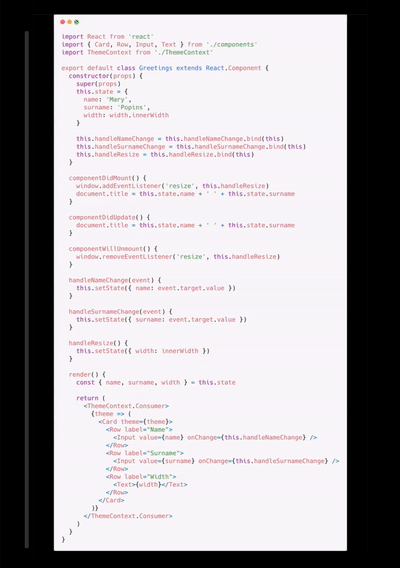

# Flame Fuse

`flame_fuse` is a library for programming [Flame](https://github.com/flame-engine/flame) components in a composable way, similar to `flutter_hooks`.

Demos are available via a widgetbook deployed [here](https://misha.jp/flame_fuse). For a complete game using this library to implement non-trivial behavior, check out the source code of [Ministry of Order](https://github.com/misha/moo).

> :warning: This project is not affiliated with Blue Fire or the official Flame project in any way.

## Installation

```bash
dart pub add flame_fuse
```

## Usage

Instead of overriding methods, behavior is composed in the `fuse` method by calling `fuse*` methods.

```dart
class SpinningSquare extends RectangleComponent with Fuse {
  @override
  void fuse() {
    fuseUpdate((dt) {
      angle += (pi / 2) * dt;
    });
  }
}
```

The `fuse` method is called exactly once during `onLoad`.

All other component methods gain behavior using the appropriate fuse. For example, `fuseUpdate` calls a function every `update`; `fuseResize` calls a function whenever the game is resized; and `fuseRemove` calls a function when the component is unmounted.

Any Flame component may use the `Fuse` mixin to gain access to this special method. All functions that add behavior inside the `fuse` method are conventionally prefixed with the word `fuse`.

> :warning: Fuses *must* be called at the top level of the `fuse` function. They cannot be called inside loops, conditionals, or nested functions. This is the same rule as React and Flutter hooks.

Additional `fuse*` functions become available if you also apply feature-specific mixins. Here is the master list of available fuses:

| Mixin               | Fuses                                                                                                                                | Description                       |
|---------------------|--------------------------------------------------------------------------------------------------------------------------------------|-----------------------------------|
| `Fuse`              | `fuseComponent`, `fuseGame`, `fuseCamera`, `fuseUpdate`, `fuseRemove`, `fuseResize`                                                  | Core fuses.                       |
| `FuseCollisions`    | `fuseCollision`, `fuseCollisionPoints`, `fuseCollisionStart`, `fuseCollisionEnd`, `fuseCollisionEffect`, `fuseCollisionEffectPoints` | Fuses related to collisions.      |
| `FuseDrags`         | `fuseDragStart`, `fuseDragUpdate`, `fuseDragEnd`, `fuseDragCancel`, `fuseDragEffect`                                                 | Fuses related to dragging.        |
| `FuseHovers`        | `fuseHoverEnter`, `fuseHoverExit`, `fuseHoverUpdate`                                                                                 | Fuses related to hovers.          |
| `FuseKeys`          | `fuseKeyEvent`                                                                                                                       | Fuses related to keys.            |
| `FuseGameKeys`      | `fuseGameKeyEvent`                                                                                                                   | Fuses related to keys for `Game`. |
| `FusePointers`      | `fusePointerMove`, `fusePointerMoveStop`                                                                                             | Fuses related to pointers.        |
| `FuseTaps`          | `fuseTapDown`, `fuseTapUp`, `fuseTapCancel`, `fuseLongTapDown`                                                                       | Fuses related to taps.            |
| `FuseDoubleTaps`    | `fuseDoubleTapDown`, `fuseDoubleTapUp`, `fuseDoubleTapCancel`                                                                        | Fuses related to double taps.     |
| `FuseSecondaryTaps` | `fuseSecondaryTapDown`, `fuseSecondaryTapUp`, `fuseSecondaryTapCancel`                                                               | Fuses related to secondary taps.  |

Most games will implement their own fuses as compositions of these core fuses.

## Why Fuse?

There are a few advantages to writing Flame components using this library.

### Without Fuse

To illustrate these advantages, consider the following `Ball` component. The component has two behaviors:

1. Bounce off walls.
2. Green by default, red when colliding.

```dart
final rng = Random();

class Ball extends CircleComponent with CollisionCallbacks {
  final velocity = Vector2.all(250) //
    ..rotate(2 * pi * rng.nextDouble());

  var _collisions = 0;

  @override
  void onLoad() {
    add(CircleHitbox());
    paint.color = Colors.green;
  }

  @override
  void update(double dt) {
    position += velocity * dt;
  }

  @override
  void onCollisionStart(Set<Vector2> intersectionPoints, PositionComponent other) {
    super.onCollisionStart(intersectionPoints, other);

    switch (other) {
      case Wall():
        velocity.reflect(other.normal);

      case Ball():
        _collisions += 1;
        paint.color = Colors.red;
    }
  }
  
  @override
  void onCollisionEnd(PositionComponent other) {
    super.onCollisionEnd(other);

    switch (other) {
      case Ball():
        _collisions -= 1;

        if (_collisions == 0) {
          paint.color = Colors.green;
        }
    }
  }
}
```

There are two major issues with this implementation:

1. The code for each behavior (movement and coloring) is interwoven throughout the component. To understand what a particular behavior ultimately does, you *must* read the entire component.
2. It is not easy or obvious how to extract the behavior to "move and bounce off walls" or "change colors while colliding" for reuse in other components.

### With Fuse

This library resolves both these issues directly.

Here is the exact same ball, rewritten using fuses:

```dart
final rng = Random();

class Ball extends CircleComponent with Fuse, CollisionCallbacks, FuseCollisions {
  @override
  void fuse() {
    add(CircleHitbox());

    //
    // Movement
    //

    final velocity = Vector2.all(250) //
      ..rotate(2 * pi * rng.nextDouble());

    fuseUpdate((dt) {
      position += velocity * dt;
    });

    fuseCollisionStart<Wall>((wall) {
      velocity.reflect(wall.normal);
    });

    //
    // Coloring
    //

    paint.color = Colors.green;
    var collisions = 0;

    fuseCollisionEffect<Ball>((_) {
      collisions += 1;
      paint.color = Colors.red;

      return () {
        collisions -= 1;

        if (collisions == 0) {
          paint.color = Colors.green;
        }
      };
    });
  }
}
```

#### Advantage #1: Locality of Behavior

In the version written with fuses, the movement and coloring code are **no longer interspersed**. In order to understand a single behavior in its entirety, you need only look at that particular section of the component. In short, it accomplishes locality of behavior.

This advantage is shared with frontend frameworks that use hooks, like React and `flutter_hooks`. The following GIF from a popular Tweet on React Hooks exemplifies the shift in code organization, where colored parts represent parts of the same feature or behavior:



#### Advantage #2: Composability

In the version written with fuses, it's trivial to extract *either* behavior into a standalone, reusable fuse. Here is how you might write a fuse that allows any component to "bounce when hitting a wall":

```dart
void fuseMovement(Vector2 velocity) {
  final component = fuseComponent<PositionComponent>();

  fuseUpdate((dt) {
    component.position += velocity * dt;
  });

  fuseCollisionStart<Wall>((wall) {
    velocity.reflect(wall.normal);
  });
}
```

Similarly, here's how you could easily extract the coloring behavior:

```dart
void fuseCollisionColoring() {
  final component = fuseComponent<HasPaint>();
  final paint = component.paint;
  paint.color = Colors.green;
  var collisions = 0;

  fuseCollisionEffect<Ball>((_) {
    collisions += 1;
    paint.color = Colors.red;

    return () {
      collisions -= 1;

      if (collisions == 0) {
        paint.color = Colors.green;
      }
    };
  });
}
```

Now any `PositionComponent` can reuse the movement logic, and any `HasPaint` can trivially reuse the coloring logic.

## Naming

The name "Fuse" was selected because this method of functional composition is shared with React and Flutter hooks. With hooks, you `use` functions. With Flame hooks, you `fuse` functions instead.

I also like that the verb "to fuse" reminds me of welding together parts in a secure way, similar to what the library tries to do with component behavior.
