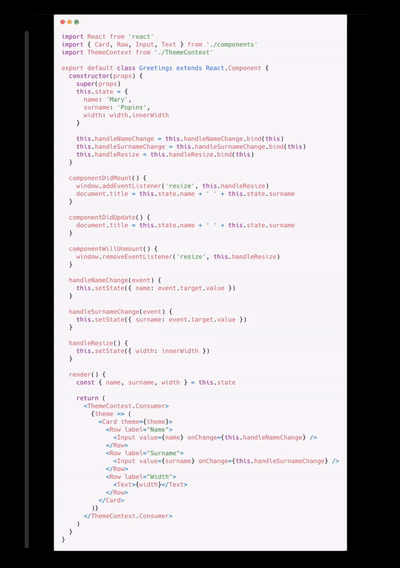

# Fuse

Fuse is a library for writing [Flame](https://github.com/flame-engine/flame) component behavior in a composable way.

## Installation

```bash
dart pub add flame_fuse
```

## Usage

Instead of implementing callbacks, all behavior is added in the `fuse` method at load time.

```dart
class SpinningSquare extends RectangleComponent with Fuse {
  @override
  FutureOr<void> fuse() {
    fuseUpdate((dt) {
      angle += (pi / 2) * dt;
    });
  }
}
```

Any Flame component may use the `Fuse` mixin to gain access to this special method. All functions that add behavior inside the `fuse` method are prefixed with the word `fuse`.

Additional `fuse*` functions become available if you also apply feature-specific mixins. Here is the master list of available fuses:

| Mixin            | Fuses                                                                                            | Description                   |
|------------------|--------------------------------------------------------------------------------------------------|-------------------------------|
| `Fuse`           | `fuseComponent`, `fuseGame`, `fuseCamera`, `fuseUpdate`, `fuseRemove`, `fuseResize`, `fuseTimer` | Core fuses.                   |
| `FuseCollisions` | `fuseCollision`, `fuseCollisionPoints`, `fuseCollisionStart`, `fuseCollisionEnd`                 | Fuses related to collisions.  |
| `FuseHovers`     | `fuseHoverEnter`, `fuseHoverExit`, `fuseHoverUpdate`                                             | Fuses related to hovers.      |
| `FuseKeys`       | `fuseKeyEvent`                                                                                   | Fuses related to keys.        |
| `FusePointers`   | `fusePointerMove`, `fusePointerMoveStop`                                                         | Fuses related to pointers.    |
| `FuseTaps`       | `fuseTapDown`, `fuseTapUp`, `fuseTapCancel`, `fuseLongTapDown`                                   | Fuses related to taps.        |
| `FuseDoubleTaps` | `fuseDoubleTapDown`, `fuseDoubleTapUp`, `fuseDoubleTapCancel`                                    | Fuses related to double taps. |

Of course, the true power of fuses is unlocked by building your own, game-specific behaviors from the core fuses.

## Why Fuse?

There are a few advantages to writing Flame components using this library.

### Without Fuse

To illustrate these advantages, consider the following `Ball` component. The component has two behaviors:

1. Bouncing off walls, which affects its velocity.
2. Randomly changing colors when colliding with other balls.

```dart
class Ball extends CircleComponent with CollisionCallbacks {
  final velocity = Vector2.all(250) //
    ..rotate(2 * pi * _RANDOM.nextDouble());

  @override
  Future<void> onLoad() async {
    await super.onLoad();
    anchor = Anchor.center;
    size = Vector2.all(33);
    paint.color = randomColor();
    add(CircleHitbox());
  }

  @override
  void update(double dt) {
    position += velocity * dt;
  }

  @override
  void onCollisionStart(
    Set<Vector2> intersectionPoints, 
    PositionComponent other,
  ) {
    super.onCollisionStart(intersectionPoints, other);

    switch (other) {
      case Wall():
        velocity.reflect(other.normal);
        break;
      case Ball():
        paint.color = randomColor();
        break;
    }
  }
}
```

There are two major issues with this implementation:

1. The code for each behavior (position and color) is interwoven throughout the component. To understand what a particular behavior ultimately does, you *must* read the entire component.
2. It is not easy or obvious how to extract the behavior to "bounce when colliding with walls" or "change colors when colliding with balls" for reuse in other components.

### With Fuse

This library resolves both these issues directly.

Here is the exact same ball component rewritten using fuses instead:

```dart
class Ball extends CircleComponent 
    with Fuse, CollisionCallbacks, FuseCollisions {

  @override
  FutureOr<void> fuse() {
    anchor = Anchor.center;
    size = Vector2.all(33);
    add(CircleHitbox(collisionType: CollisionType.active));

    final velocity = Vector2.all(250) //
      ..rotate(2 * pi * _RANDOM.nextDouble());

    fuseUpdate((dt) {
      position += velocity * dt;
    });

    fuseCollisionStart<Wall>((wall) {
      velocity.reflect(wall.normal);
    });

    paint.color = randomColor();

    fuseCollisionStart<Ball>((_) {
      paint.color = randomColor();
    });
  }
}
```

#### Advantage #1: Locality of Behavior

In the version written with fuses, the position behavior code and the color behavior code are **no longer interspersed**. In order to understand a single behavior in its entirety, you need only look at that particular section of the component. In short, it accomplishes locality of behavior.

This advantage is shared with frontend frameworks that use hooks, like React and `flutter_hooks`. The following GIF from a popular Tweet on React Hooks exemplifies the shift in code organization, where colored parts represent parts of the same feature or behavior:



##### Advantage #2: Composability

In the version written with fuses, it's trivial to extract *either* behavior into a standalone, reusable fuse. Here is how you might write a fuse that allows any component to "bounce when hitting a wall":

```dart
void fuseBallMovement(Vector2 velocity) {
  final component = fuseComponent<PositionComponent>();

  fuseUpdate((dt) {
    component.position += velocity * dt;
  });

  fuseCollisionStart<Wall>((wall) {
    velocity.reflect(wall.normal);
  });
}
```

Similarly, here's how you could easily extract the color behavior:

```dart
void fuseBallRecolor() {
  final component = fuseComponent<HasPaint>();
  component.paint.color = randomColor();

  fuseCollisionStart<Ball>((_) {
    component.paint.color = randomColor();
  });
}
```

Now anything with a velocity vector or a `Paint` object can trivially share either of those behaviors with the `Ball` component.

## Development

The main Fuse project is stored in the top-level directory.

The tests are written in a Storybook located in the `fuse_test` package. Unfortunately, the top-level project is a package-type project and cannot have a platform attached to it. As a result, I have opted to have a separate, application-type project to host the Storybook instead.

If you have any problems or suggestions, please open an issue on GitHub.

## Naming

The name "Fuse" was selected because this method of functional composition is shared with React and Flutter hooks. With hooks, you `use` functions. With Flame hooks, you `fuse` functions instead.

I also like that the verb "to fuse" reminds me of welding together parts in a secure way, similar to what the library tries to do with component behavior.
